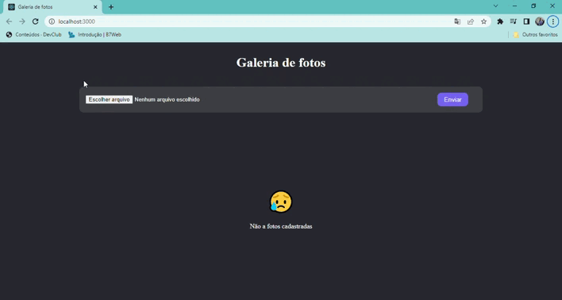

# Galeria de fotos

> Projeto finalizado 
 

## 💻 Sobre o Projeto

Este projeto trata-se de uma app de fotos, aonde voce pode adicionar suas fotos acessando sua pasta, excluir a imagem conforme sua preferencia ou deixa-las guardadas!

utilizei as ferramentas: React.js, typescript, Styled-componentes, firabase com as variveis de ambiente 

 

## 👨‍💻Link para acesso: 
<a href="https://photosgaller.netlify.app/">Aperte aqui ⬅ </a>

## ☕ tecnologias utilizadas

 

## 🤝 Colaborador

<table>
  <tr>
    <td align="center">
      <a href="#">
         
        
          <a >Gabriel Ibiapino</a>
        
      </a>
    </td>
  </tr>
</table>

  

 

[⬆ Voltar ao topo](#Galeria-de-fotos)<br